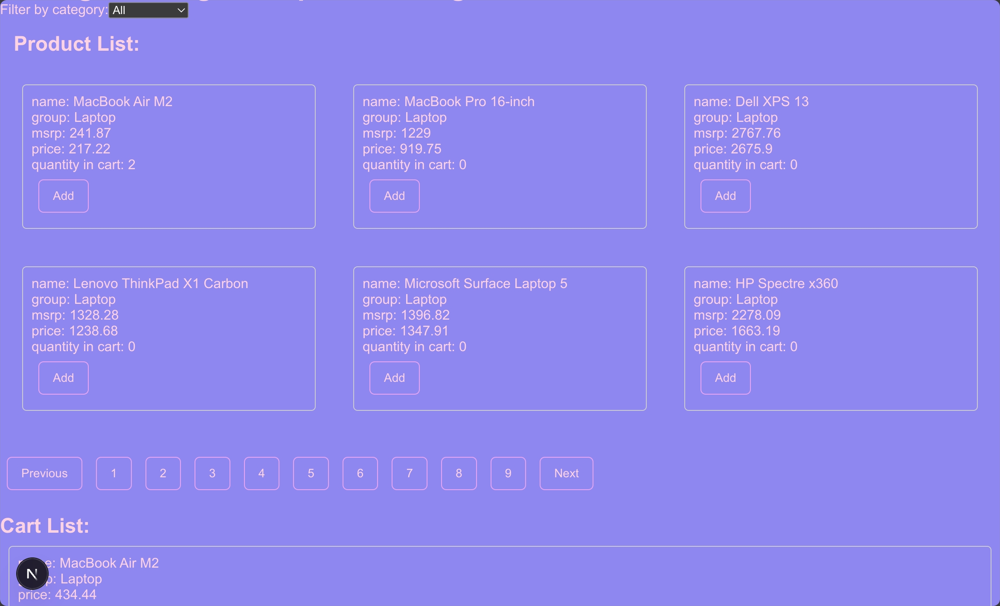

# Challenge for [Spot and Tango](https://spotandtango.com/)

## Task description

### 📌 Project Scope & Requirements

* **Tech Stack**: Use vanilla HTML, CSS, and JavaScript or a framework (React, Vue, or Angular)—whichever you're most comfortable with.
* **Data Source**: Fetch product data from this JSON endpoint:
  * https://s3.us-east-1.amazonaws.com/assets.spotandtango/products.json
* **Time Limit:** Spend no more than 2-3 hours focusing on a clean and functional design.

### Core Feature #1 — Display Product Listings
* Fetch and display all available products from the JSON endpoint.
* Show the following details for each product: Name, Category (Laptop, Tablet, Mobile, Accessory), MSRP (original price), and sales price
* If a product is unavailable (sold out), disable selection and display a "Sold Out" indicator.

### Core Feature #2 — Shopping Cart Functionality
* Allow users to add multiple products to their cart.
* Users should be able to choose quantities for each item.
* Dynamically update the total cost as items are added.
* Show a cart summary listing selected items.

### 💡 Bonus (Optional Enhancements)
* Style the interface to improve UX/UI.
* Consider adding a category filter (e.g., show only "Laptops" or "Accessories")

## Implementation

